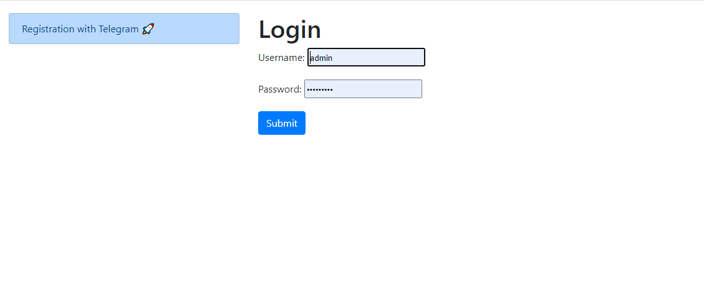
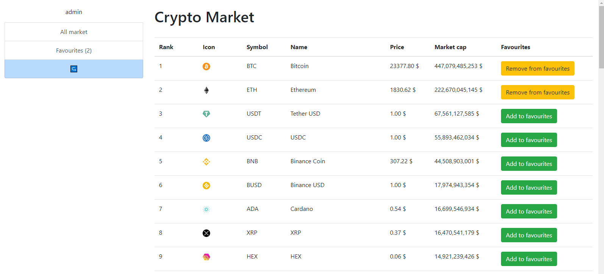

# Crypto-Django-Telegram project

Django project for getting crypto prices with telegram bot registration.

## Check it out!

[Deployed on heroku](https://crypto-django-telegram.herokuapp.com/)


## Installation

Python3 must be already installed

```shell
git clone https://github.com/Serhii-Leonenko/crypto-django-telegram
cd crypto_django_telegram
python3 -m venv venv
source venv/bin/activate
pip install -r requirements.txt
python manage.py runserver  # starts Django Server
python manage.py bot # run bot
```



